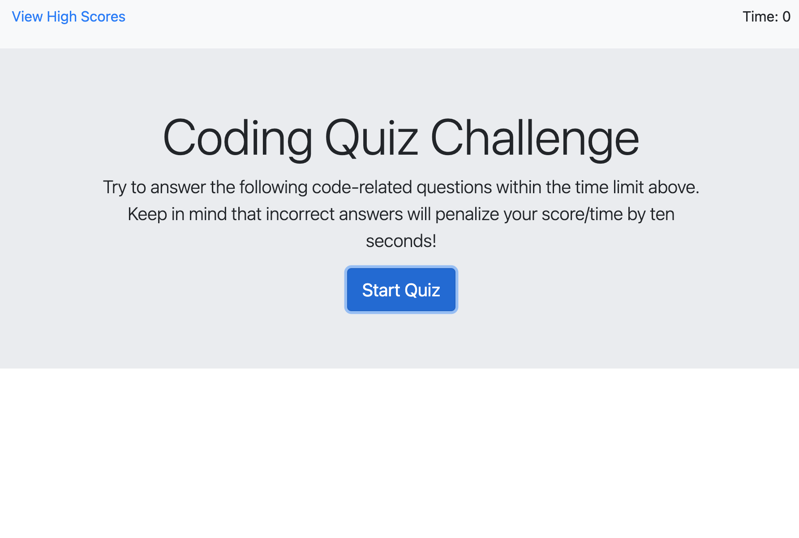

# Description

This quiz will test your knowledge of javascript language. Each participant will be alloted 75 seconds upon starting and lose 10 seconds on a wrong answer and 10 seconds added to the time on correct answer. At the end time left will be the final score and participants can also save your final scores along with their initials.

# Technology Used:

HTML
CSS
Javascript
Bootstrap

# Live Site

Live site: https://katochsenthal.github.io/code-quiz/

Repo site: https://github.com/katochsenthal/code-quiz

# Preview

# Credits

Senthol
